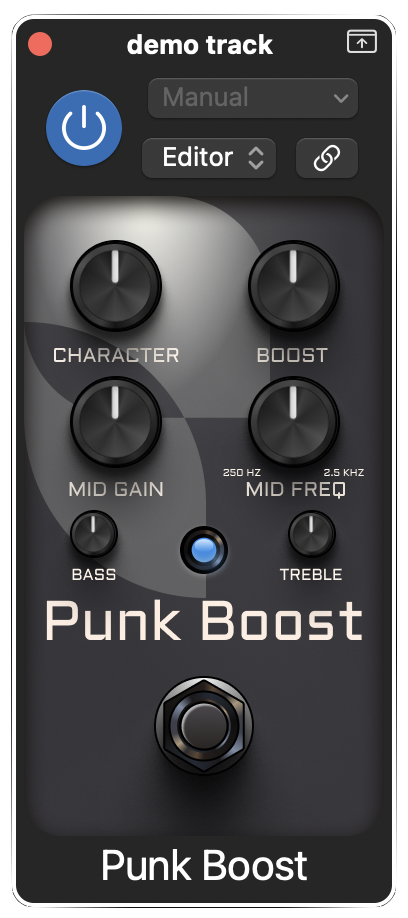

# PunkBoost
 

## Introduction
This is a simple vst3/au booster plugin made with [JUCE](https://juce.com/) that I built to introduce myself in the JUCE framework. The functionality is somewhat inspired by the [Harmonic Booster by Darkglass](https://www.darkglass.com/creation/harmonic-booster/), but I implemented my own processing without trying out the original pedal.

## Features
- **Pre equalization controls**:
    - Bass: ±12dB at 80Hz.
    - Mids: ±12dB at selected frequency.
    - Highs: ±12dB at 5kHz.
- **Boost**: ±12dB of gain that feed a parallel exciter processor.
    - As of now, the exciter is simply a saturation processor made with compressors and waveshapers that are blended with the clean signal to generate some harmonics.
    - I may change this behaviour if I find any kind of exciter processor that (IMO) sounds better.
- **Character**, a post-boost equalizer controlled with a single knob inspired in the VPF control on Markbass amplifiers.
    - At minimum, the eq curve is flat.
    - At maximum, the eq curve boosts lows and highs and dips the mids (around 500Hz). It kinda acts like a cab IR.

## Interesting links

* [Complex non-linearities for audio signal processing](https://ccrma.stanford.edu/~jatin/papers/Complex_NLs.pdf)